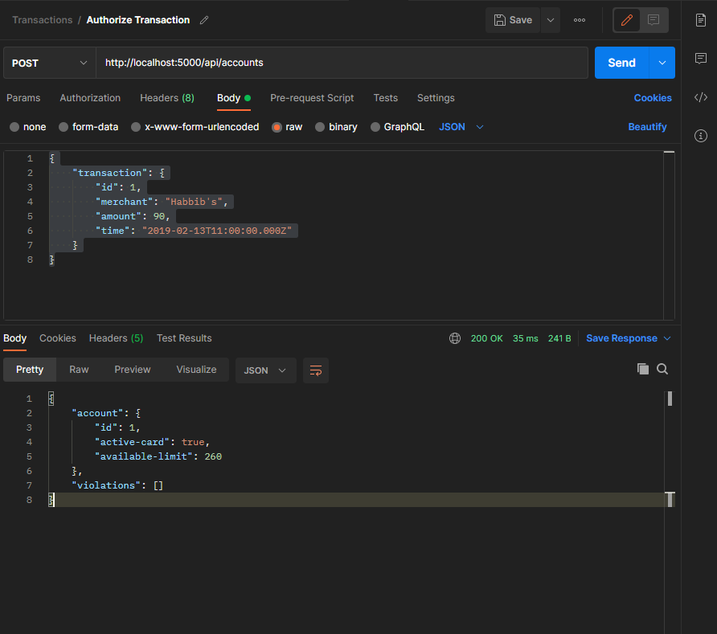

# Lulo Bank: Code Challenge: Transaction Authorizer

## Instalación

### Requerimientos

Tener instalado docker (versión mínima 20.10.8)

### Construcción de la aplicación

Luego de descargar el repositorio la aplicación se construye con los siguiente comandos en consola

- ./gradlew build
- docker build -t transactionauthorizerdocker .

### Ejecutar aplicación

Para probar la aplicación se debe ejecutar con el siguiente comando

- docker run -p 5000:9090 transactionauthorizerdocker

## Manual de usuario

La aplicación consta de un solo endpoint http://localhost:5000/api/accounts con método POST

### Creación de cuentas

Para crear una cuenta se debe enviar un json con el siguiente formato:

```
{
    "account": {
        "id": 1,
        "active-card": true,
        "available-limit": 350
    }
}
```

Lo que devuelve la información de la cuenta creada como se puede ver en la siguiente imagen:


### Autorización de transacciones

Las transaciones se ejecutan sobre el mismo endpoint, enviando un json con el siguiente formato:

```
{
    "transaction": {
        "id": 1,
        "merchant": "Habbib's",
        "amount": 90,
        "time": "2019-02-13T11:00:00.000Z"
    }
}
```

Lo que devuelve la información de la cuenta actualizada con la nueva cantidad disponible como se puede observar en la siguiente imagen:



## Manual técnico

- Se implementó una solución basada en microservicios
- Se utilizó arquitectura hexagonal basada en los módulos de: Infraestructura, Puertos, Adaptadores, Aplicación y Dominio
- Lenguaje de programación JAVA 1.8
- Framework Spring Boot
- Contenedor Docker
- CQRS basado en un bus de comandos y consultas
- Algunos de los patrones utilizados fueron: Entity, repository, domain events y builder.  
- Se implementaron técnicas de clean code
- Parte del desarrollo fue con la técnica TDD
- Se realizaron test unitarios y de integración


# Acerca del desarrollador

- David Esteban Escobar
- Ingeniero de Sistemas e Informática de la Universidad Nacional de Colombia
- 3 Años de experiencia en desarrollo de software